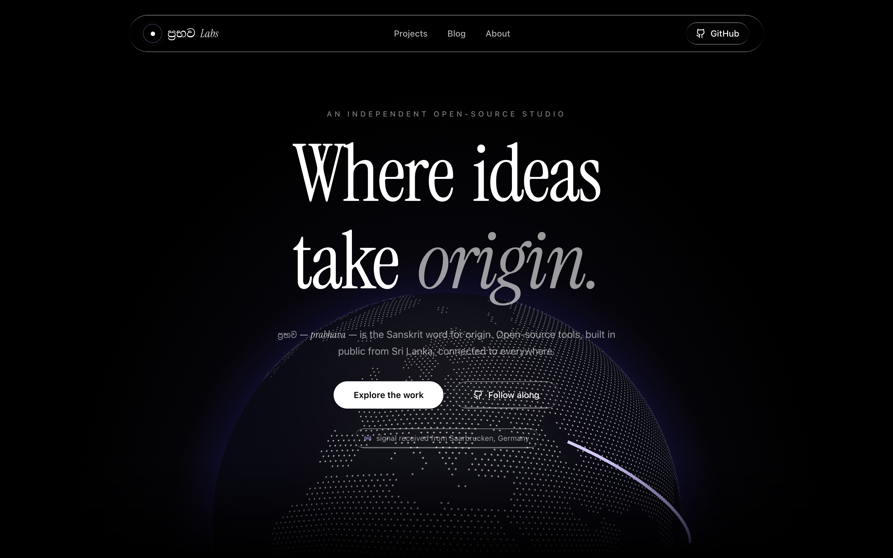
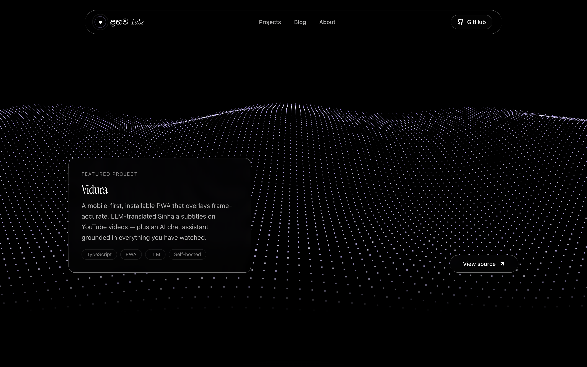
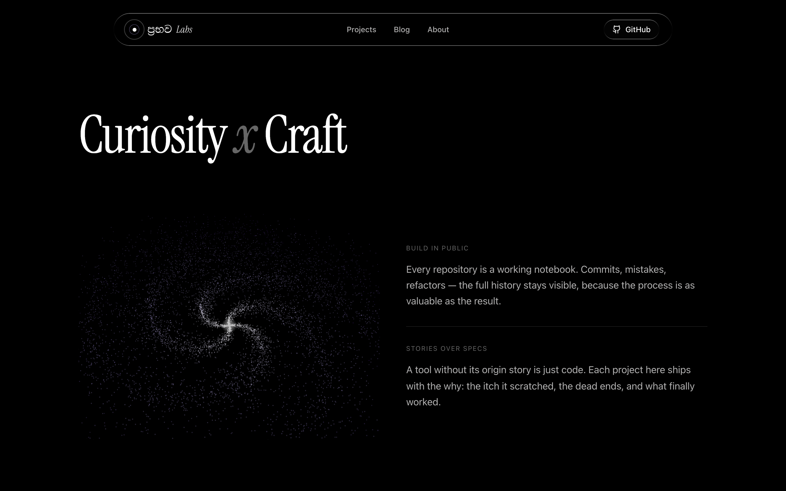
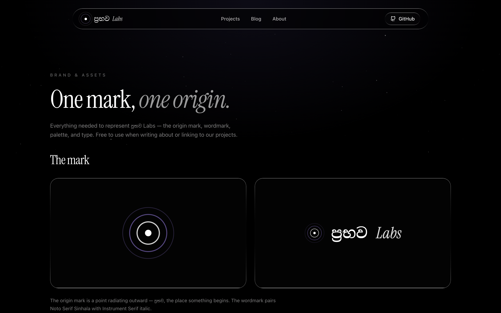

<div align="center">

# ප්‍රභව Labs

**prabhavalabs.com, the home for everything I build in the open.**

[Live site](https://prabhavalabs.com) · [Projects](https://prabhavalabs.com/projects) · [Blog](https://prabhavalabs.com/blog) · [Brand](https://prabhavalabs.com/brand)



</div>

## Why this exists

ප්‍රභව (prabhava) is the Sanskrit word for origin, the point where something
begins. I picked it as the name for my open-source work because it describes
what I actually care about: not the polished 1.0, but the moment an idea
starts, and everything messy between that moment and something people can use.

Most portfolio sites list repositories. I wanted the opposite of a list. My
belief is that a tool without its origin story is just code, so every project
here ships with the why: the itch it scratched, the dead ends, and what
finally worked. The engineering blog carries the longer write-ups.

The other conviction behind the site is that open-source work deserves the
same visual care an agency would give a paying client. Independent developers
tend to underdress their own work. This site is my argument against that
habit.

## The interactive scenes

There are no stock photos and no videos here. Every visual is a live three.js
scene, rendered in your browser, and each one means something:

**The globe.** A dotted world with arcs flying toward Colombo, because that is
where the work originates. The site looks up your rough location when you
visit and fires one bright arc from your city to mine, with a small "signal
received" badge. During testing the first badge greeted me from Saarbrücken,
Germany, and it still makes me smile that a stranger's visit draws a new line
on the map. You can grab the globe and spin it.



**The wave.** About ten thousand points rolling under the featured project.
Move your pointer across it and a ripple follows you.



**The galaxy.** A spiral of nine thousand particles radiating from a bright
core. Drag it, throw it, watch it keep spinning. It is the origin idea drawn
as an object.

A small confession: the first version of this site used AI-generated
background videos. They cost about six dollars to produce with Veo and they
looked fine, but fine was the problem. A looping video ignores you. The
scenes that replaced them react to the person watching, which fits a site
about work made for people. The videos now live in a folder called archive.

## How it is built

The site is Astro 5 with React islands. Every page is prerendered to static
HTML and served from Cloudflare's edge, so the first paint costs almost
nothing. Interactivity is opt-in per component: three.js loads only on the
landing page, only in the browser, while article pages ship no JavaScript at
all.

Content is plain markdown. Adding a project means dropping one file into
`src/content/projects/` with a few frontmatter fields; the grid, the detail
page, and the featured slot on the landing page all update from that single
file. Blog posts work the same way in `src/content/blog/`. There is no CMS
and no database, and for a one-person studio that is a feature.

Styling is Tailwind v4 plus a small liquid-glass system, with Instrument
Serif for display type and Noto Serif Sinhala so ප්‍රභව renders the way it
should. Scroll animation comes from Motion, smooth scrolling from Lenis.

## Running it locally

```sh
npm install
npm run dev        # http://localhost:4321
npm run build      # static build to ./dist
npm run deploy     # build and push to Cloudflare Workers
```

Deployment is Cloudflare Workers static assets with custom domains for
prabhavalabs.com and www. The `infra/` folder holds small helper workers,
currently a redirect that points vidura.prabhavalabs.com at the Vidura app.

## Brand

The origin mark, wordmark, palette, and typography live at
[prabhavalabs.com/brand](https://prabhavalabs.com/brand), with downloadable
SVG and PNG files under `public/brand/`. The mark is a single point with
rings radiating outward. In the navbar it animates, pulsing like ripples on
water.

<div align="center">

</div>

## Projects

The first resident of the shelf is [Vidura](https://github.com/prabhavalabs/vidura),
a PWA that overlays LLM-translated Sinhala subtitles on YouTube videos. More
are on the way; each arrives with its story.
